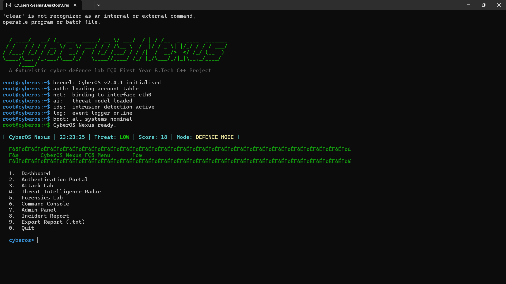
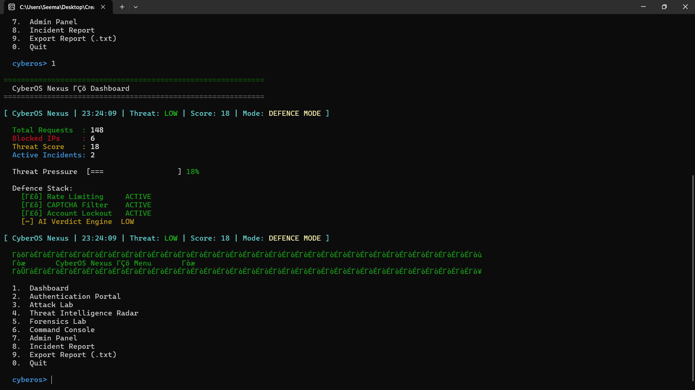
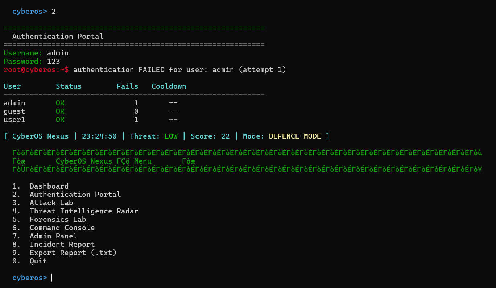
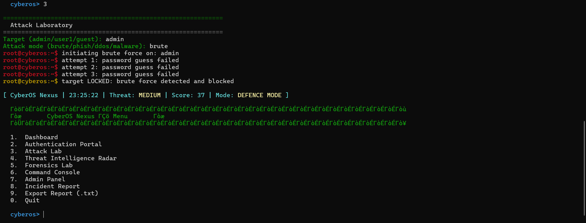
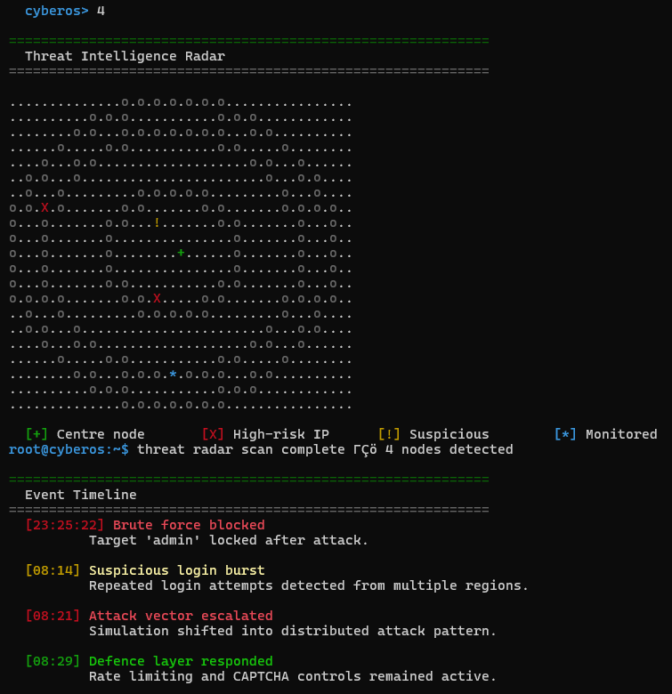
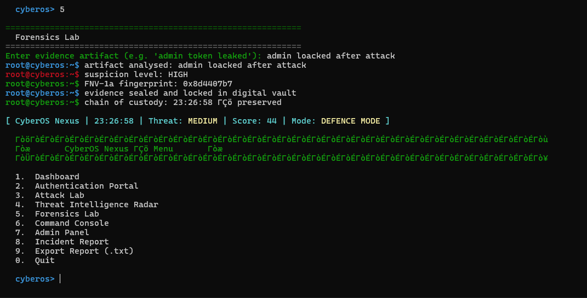
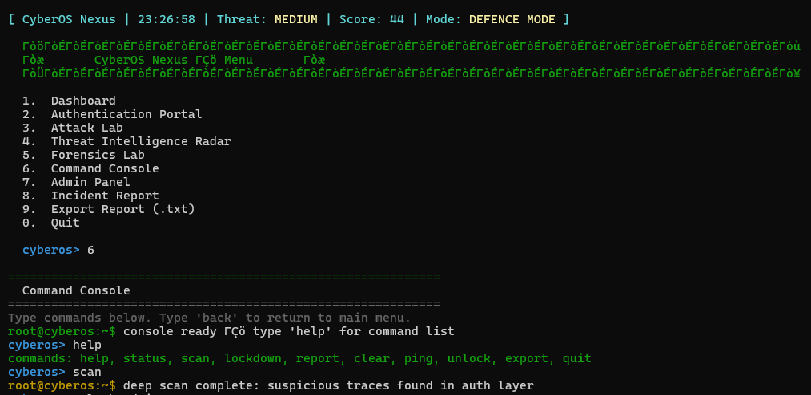
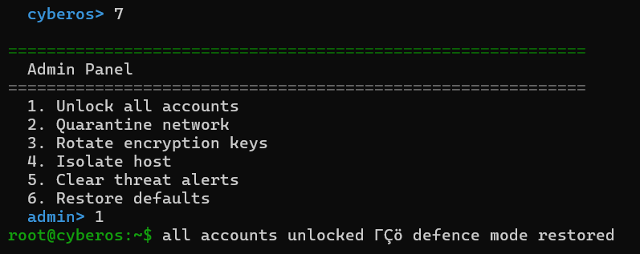
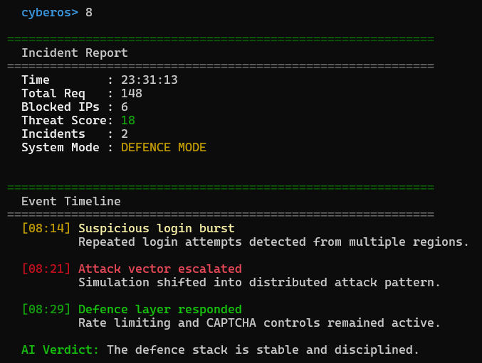

# CyberOS Nexus

<p align="center">
  
  
</p>

CyberOS Nexus is a futuristic terminal-based cyber defence simulator built using C++.

The project simulates:
- authentication systems
- brute force prevention
- phishing detection
- DDoS simulations
- malware response
- digital forensics
- SOC monitoring
- admin defence controls

This was created as a first-year B.Tech C++ project inspired by Linux terminals and real Security Operations Centers (SOC).

---

# Preview

## Boot Sequence


## Dashboard
Shows:
- threat score
- blocked IPs
- defence stack
- AI verdict engine



## Authentication Portal
Simulates:
- failed login detection
- cooldowns
- account monitoring
- brute force protection



## Attack Laboratory
Simulates:
- brute force attacks
- phishing attacks
- malware payloads
- DDoS traffic



## Threat Intelligence Radar
Displays:
- monitored nodes
- suspicious systems
- attack timelines
- active threats



## Forensics Lab
Includes:
- evidence analysis
- chain of custody
- hash fingerprinting
- digital vault simulation



## Command Console
Linux-style interactive command shell.

Supported commands:
```bash
help
status
scan
lockdown
unlock
report
export
clear
```



## Admin Panel
Administrative defence controls:
- quarantine network
- rotate keys
- isolate host
- restore defaults



## Incident Report
Generates a full defence report with:
- threat statistics
- event timeline
- AI verdict
- export system



---

# Project Structure

```txt
CyberOS-Nexus/
│
├── CyberOS_Nexus.cpp
├── CyberOS_Nexus.exe
├── CyberOS_Nexus_Imagination.html
├── security_log.txt
├── cyberos_nexus_report.txt
└── README.md
```

---

# Running the Project

## Linux / WSL / macOS

### Install g++

Ubuntu / Debian:
```bash
sudo apt install g++
```

Arch Linux:
```bash
sudo pacman -S gcc
```

Fedora:
```bash
sudo dnf install gcc-c++
```

### Compile
```bash
g++ -std=c++17 -o CyberOS_Nexus CyberOS_Nexus.cpp
```

### Run
```bash
./CyberOS_Nexus
```

---

## Windows

### Compile
```bash
g++ -std=c++17 -o CyberOS_Nexus.exe CyberOS_Nexus.cpp
```

### Run
```bash
CyberOS_Nexus.exe
```

Or directly open:
```txt
CyberOS_Nexus.exe
```

---

# HTML Overlay

If you do not want the terminal version, open:

```txt
CyberOS_Nexus_Imagination.html
```

inside any browser.

The overlay provides:
- futuristic UI
- Linux terminal vibe
- threat radar
- attack simulations
- glassmorphism dashboard
- interactive controls

---

# Features

- Login Authentication
- CAPTCHA Protection
- Brute Force Detection
- Threat Monitoring
- Digital Forensics
- Incident Reporting
- Linux Command Console
- Admin Controls
- AI Threat Simulation

---

# Author

Aarush Sharma  
B.Tech CSE (Cybersecurity)  
First C++ Project
